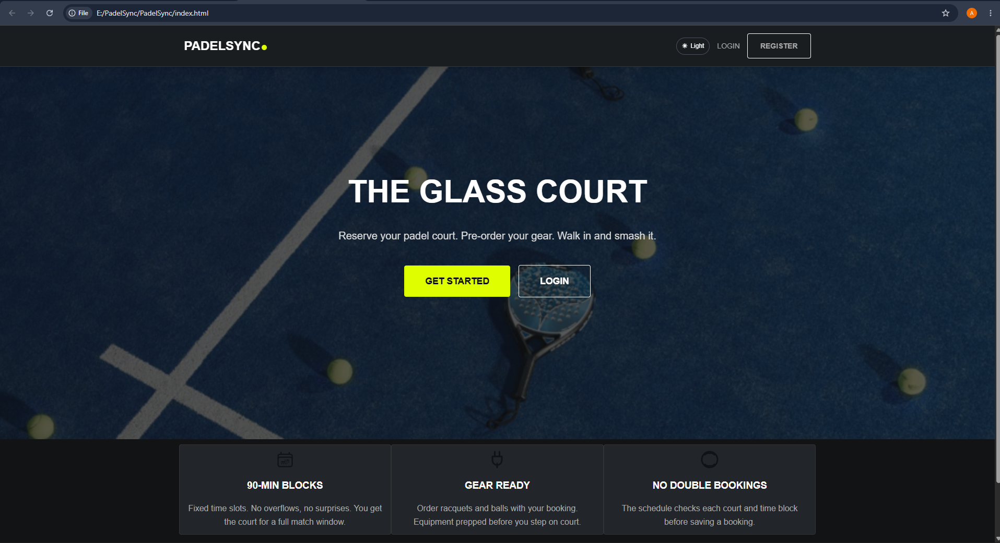
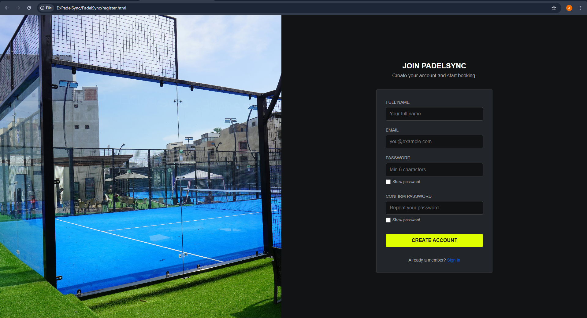
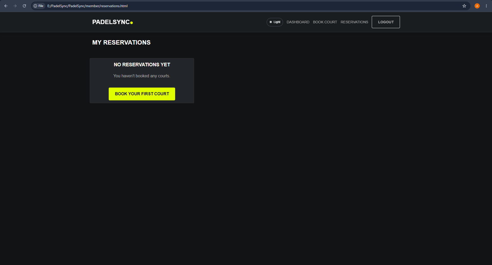
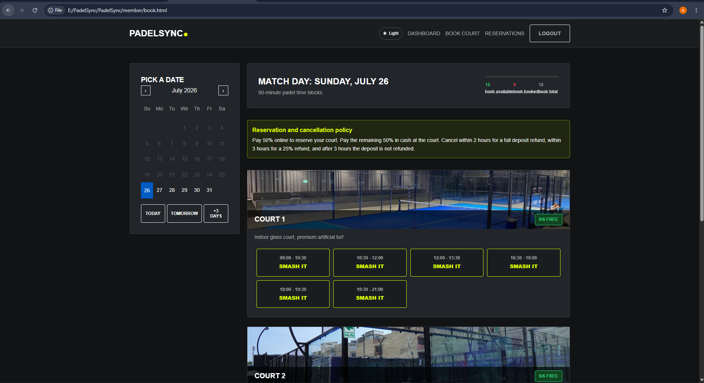

# 🎾 PadelSync

> A modern web application for discovering, booking, and managing padel courts.

---

# 📖 Overview

PadelSync is a responsive web application developed as part of the **SWE230 – Web Application Development** course at **Misr International University (MIU)**.

The system allows users to browse available padel courts, create an account, log in securely, reserve courts, and manage their reservations. Administrators can manage courts, bookings, and users through a dedicated dashboard.

The project focuses on responsive design, modern UI/UX, JavaScript validation, and team collaboration using Git and GitHub.

---

# ✨ Features

## 👤 Member

- Register a new account
- Secure login
- Password visibility toggle
- Browse available courts
- Book a court
- View reservations
- Responsive member dashboard
- Client-side form validation

---

## 🛠️ Administrator

- Admin dashboard
- Manage courts
- Manage bookings
- Manage users
- View system information

---

# 🚀 Technologies Used

### Frontend

- HTML5
- CSS3
- JavaScript (ES6)

### Development Tools

- Visual Studio Code
- Visual Studio 2022
- Git
- GitHub

---

# 📂 Project Structure

```text
PadelSync/
│
├── admin/
│   ├── dashboard.html
│   ├── bookings.html
│   ├── courts.html
│   └── users.html
│
├── member/
│   ├── dashboard.html
│   ├── reservations.html
│   └── book.html
│
├── assets/
├── css/
├── js/
├── screenshots/
│
├── index.html
├── login.html
├── register.html
├── 404.html
└── README.md
```

---

# 📸 Screenshots

## 🏠 Home Page



---

## 🔐 Login


---

## 📝 Register



---

## 👤 Member Dashboard


---

## 📅 My Reservations



---

## 🎾 Book Court



---

## 🛠️ Admin Dashboard


---

## 👥 Manage Users


---

## 📋 Manage Bookings


---

## 🎾 Manage Courts


---

# ✔️ Validation

The project includes client-side validation using JavaScript.

Validation features include:

- Required field validation
- Email format validation
- Password validation
- Confirm password matching
- Booking form validation
- User-friendly error messages
- Password visibility toggle

---

# 🎨 UI / UX Highlights

- Responsive design
- Modern interface
- Clean layout
- Interactive buttons
- Hover effects
- Mobile-friendly pages
- Smooth navigation

---

# 👥 User Roles

## Member

- Register
- Login
- Browse courts
- Book courts
- View reservations

### Member Pages

- Home
- Login
- Register
- Book Court
- Reservations
- Dashboard

---

## Administrator

- Dashboard
- Manage Courts
- Manage Bookings
- Manage Users

---

# 💡 Project Highlights

- Modern responsive interface
- Organized project structure
- Password visibility feature
- Interactive booking system
- Modular JavaScript files
- Git & GitHub collaboration workflow

---

# 🌍 Browser Support

- ✅ Google Chrome
- ✅ Microsoft Edge
- ✅ Mozilla Firefox

---

# ⚙️ Installation

Clone the repository:

```bash
git clone https://github.com/adam3glann/PadelSync.git
```

Navigate to the project folder:

```bash
cd PadelSync
```

Open `index.html` in your preferred web browser.

---

# 👥 Team Members

| Name | Role |
|------|------|
| Adam Adel | Frontend Development |
| Omar Yassseen | Frontend Development |
| Mafdy Nader | Frontend Development |
| Sayed Mohamed | Frontend Development |
| Sayed Said | Frontend Development |

---

# 🔀 GitHub Workflow

Each team member works on a dedicated branch.

Branches used in this project:

- `main`
- `adam`
- `omar`
- `mafdy`
- `sayed-mohamed`
- `sayed`

Workflow:

1. Create or switch to your branch.
2. Develop your assigned feature.
3. Commit your changes.
4. Push your branch to GitHub.
5. Open a Pull Request.
6. Merge the Pull Request into `main`.

---

# 🚀 Future Improvements

- Backend integration
- Online payment support
- Email notifications
- Court availability filtering
- User profile management
- Booking history
- Admin analytics dashboard

---

# 📚 Course Information

**Course:** SWE230 – Web Application Development

**Faculty:** Computer Science

**University:** Misr International University (MIU)

---

# 📄 License

This project was developed for educational purposes as part of the SWE230 – Web Application Development course.