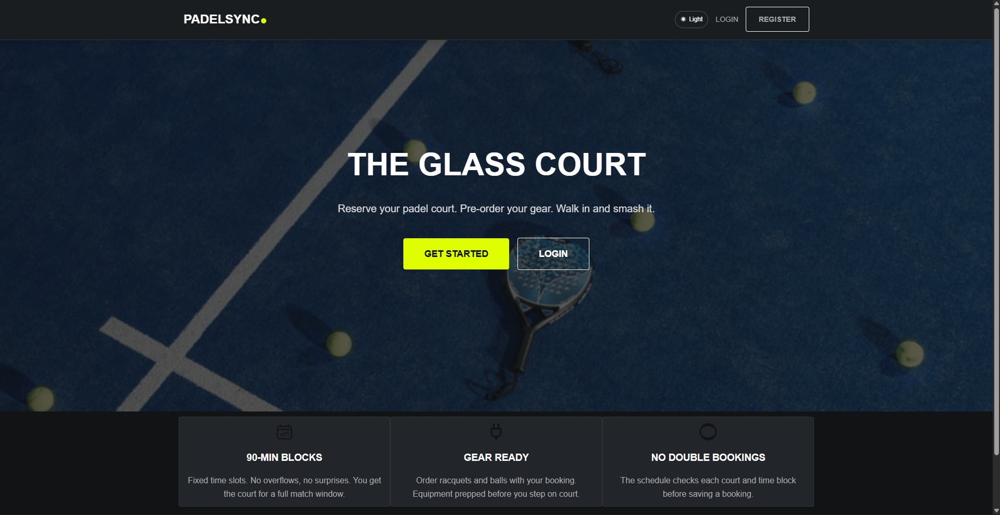
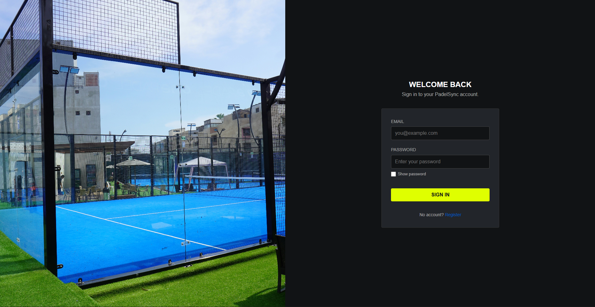
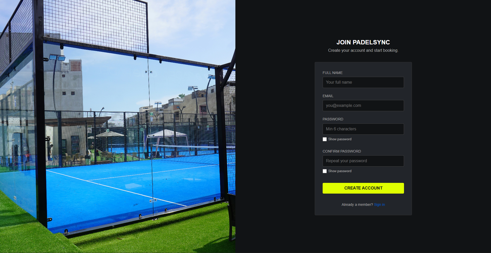
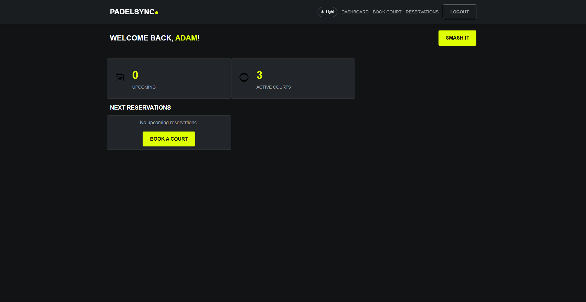
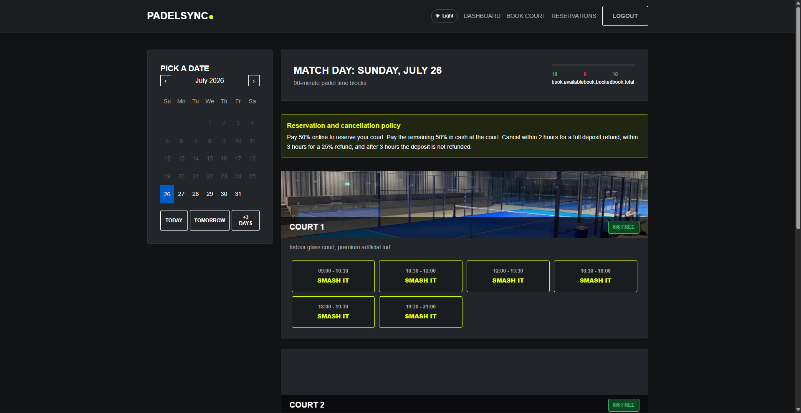
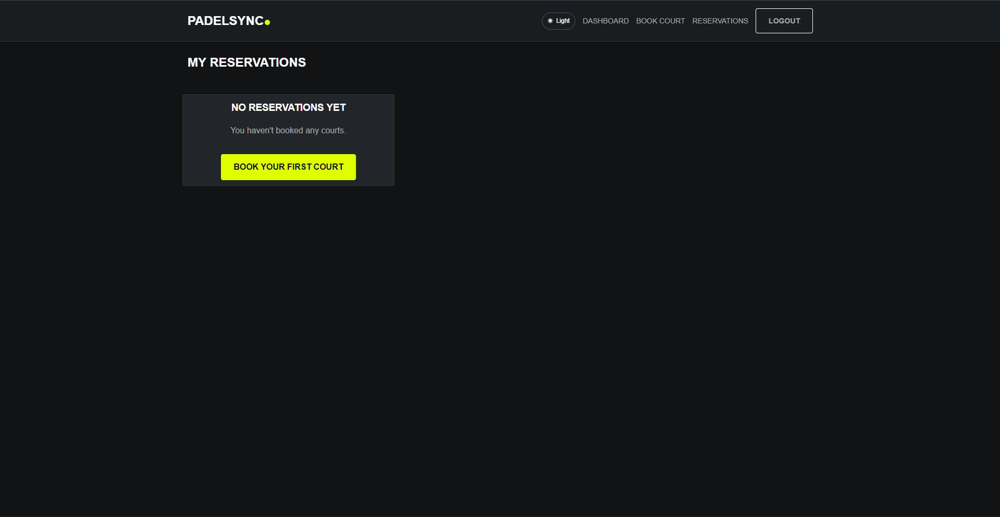
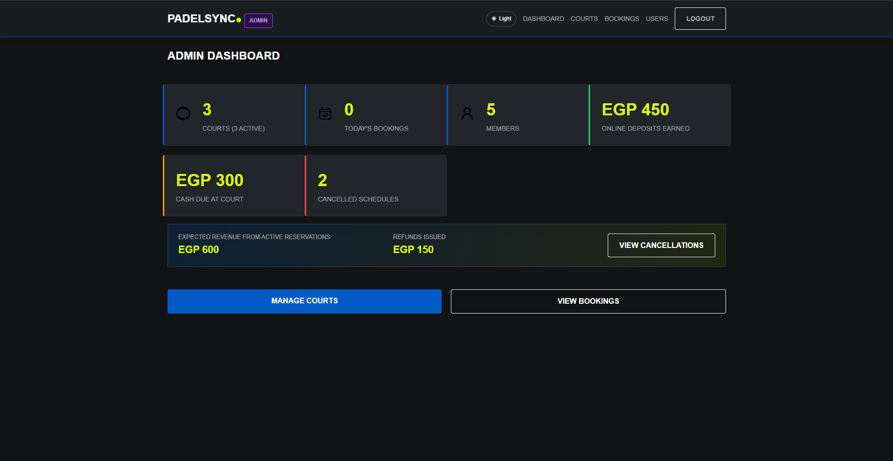
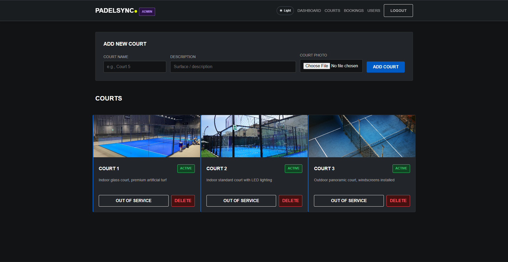
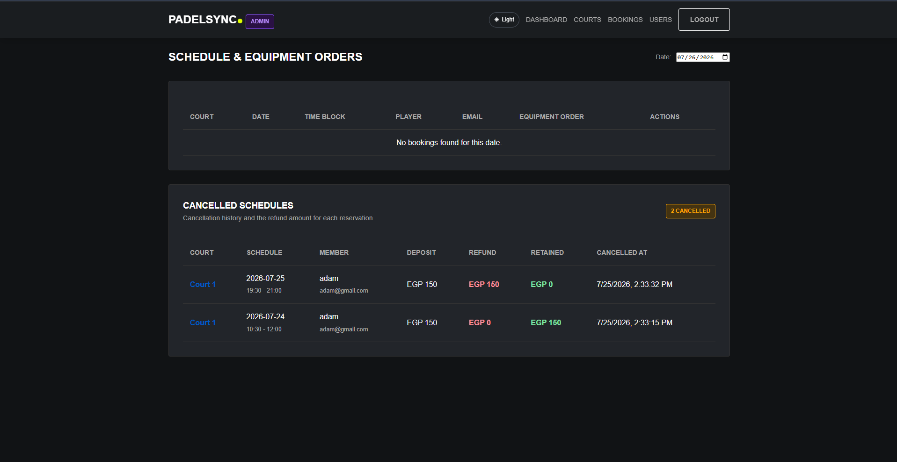
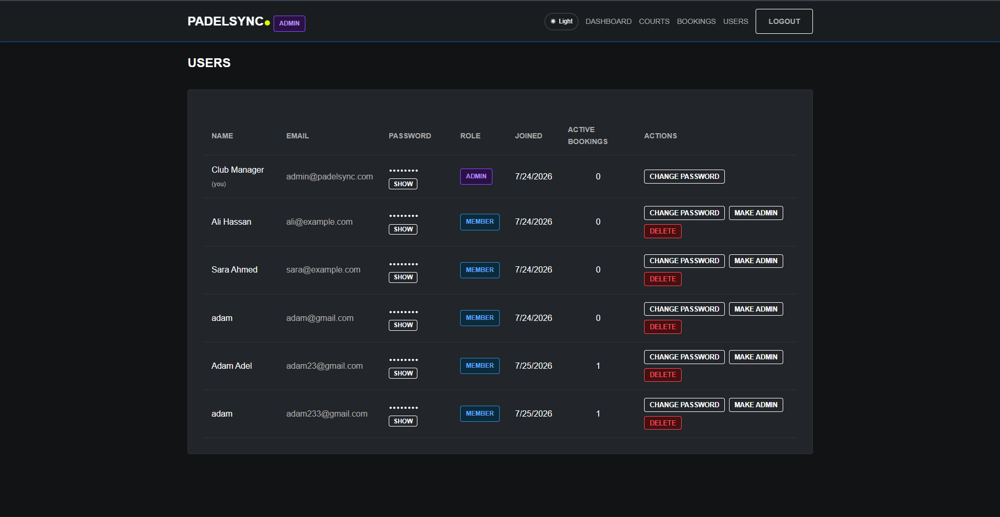

# 🎾 PadelSync

**A Full-Stack Padel Court Reservation & Management Platform**

Built for **SWE230 — Web Application Development**
**Faculty of Computer Science — Misr International University (MIU)**

[](https://padelsync-production.up.railway.app)

**🔗 Live App:** [padelsync-production.up.railway.app](https://padelsync-production.up.railway.app)

---

## 🛠️ Technologies Used

**Frontend:** HTML5 · CSS3 · JavaScript (ES6) — no framework, no build step

**Backend:** Node.js · Express.js · MongoDB · Mongoose · JWT Authentication · bcryptjs · Multer · dotenv

**Deployment:** Railway (Nixpacks build, HTTPS provided automatically)

---

## 📑 Table of Contents

- [Overview](#-overview)
- [Features](#-features)
- [Architecture](#-architecture)
- [Project Structure](#-project-structure)
- [Screenshots](#-screenshots)
- [Backend](#-backend)
- [Frontend](#-frontend)
- [Installation](#-installation)
- [Environment Variables](#-environment-variables)
- [Git Workflow](#-git-workflow)
- [Team](#-team-members)
- [Future Improvements](#-future-improvements)

---

## 📖 Overview

PadelSync is a full-stack web application that lets people discover, reserve, and manage padel courts through a modern web interface. Admins manage courts, members, and bookings from a dedicated dashboard.

The project is organized into two modules:

- **`frontend/`** — HTML, CSS, and vanilla JavaScript UI (served statically by the backend)
- **`backend/`** — Express REST API backed by MongoDB

The application supports two user roles:

- 👤 **Member** — browses and books courts
- 🛠 **Administrator** — manages courts, users, and bookings

---

## ✨ Features

### Member
- User registration & secure login (JWT)
- Browse available courts with photos and pricing
- Book a court in fixed 90-minute time blocks
- View, filter, and cancel personal reservations
- Time-based cancellation refund policy (full refund >2h before play, partial 25% between 2–3h, none after)
- Account settings
- Responsive dashboard with live weather for the club location

### Administrator
- Dashboard with live stats: courts, members, today's bookings, revenue, refunds
- Manage courts — create, edit, activate/deactivate, delete, upload photos
- Manage users — view, promote/demote roles, change passwords, delete
- Manage bookings — view all bookings, cancel any booking, view cancellation history

### Platform-wide
- 🌍 **Localization** — full English/Arabic translation with automatic RTL layout switch
- 📄 **Pagination** — on courts, bookings, and users lists
- 🔒 **Security** — JWT auth, bcrypt password hashing, role-based access control, rate limiting on auth/booking endpoints, security headers, and a CORS allow-list
- 🌦 **External API integration** — live weather via OpenWeatherMap
- 🖼 **File uploads** — court photo uploads via Multer with type/size validation
- ✅ **Data validation** — enforced on both the frontend (inline field validation) and backend (schema + controller-level checks)
- 🚫 **Double-booking prevention** — enforced at the database level with a unique compound index
- 🔐 **HTTPS** — served over HTTPS automatically by Railway's deployment platform

---

## 🏗 Architecture

```text
Browser
   │
Frontend (HTML / CSS / JavaScript)
   │
Fetch API  ──▶  /api/*
   │
Express.js REST API (MVC)
   │
MongoDB (Mongoose)
```

The backend follows an MVC pattern: **Models** define the MongoDB schemas, **Controllers** hold the business logic, and **Routes** wire HTTP endpoints to controllers, protected by **Middleware** for auth, role checks, rate limiting, and error handling.

---

## 📂 Project Structure

```text
PadelSync/
├── frontend/
│   ├── admin/              # Admin-facing pages (dashboard, courts, users, bookings)
│   ├── member/              # Member-facing pages (dashboard, booking, reservations)
│   ├── assets/               # Images and icons
│   ├── css/
│   ├── js/                    # Modular vanilla JS (one file per page/concern)
│   ├── screenshots/
│   ├── index.html
│   ├── login.html
│   ├── register.html
│   └── 404.html
│
├── backend/
│   ├── config/               # Database connection
│   ├── controllers/         # Business logic per resource
│   ├── middleware/         # Auth, role checks, rate limiting, security headers, error handling
│   ├── models/                # Mongoose schemas (User, Court, Booking)
│   ├── routes/                # Express routers
│   ├── utils/                  # Shared constants/helpers
│   ├── uploads/               # Uploaded court photos (gitignored — see note below)
│   ├── app.js
│   └── package.json
│
├── railway.toml / nixpacks.toml   # Deployment configuration
├── package.json                        # Root scripts (delegates to backend/)
├── README.md
└── .gitignore
```

> **Note on `backend/uploads/`:** this folder is intentionally gitignored so real user-uploaded photos never get committed to the repo. On deploy, the server creates the folder automatically if it doesn't exist. In production it's backed by a persistent Railway Volume so uploaded court photos survive redeploys.

---

## 📸 Screenshots

### Home


### Login


### Register


### Member Dashboard


### Book a Court


### My Reservations


### Admin Dashboard


### Manage Courts


### Manage Bookings


### Manage Users


---

## 🔐 Backend

The backend follows an MVC architecture with these components:

- **Config** — MongoDB connection (`config/db.js`)
- **Models** — `User`, `Court`, `Booking` (Mongoose schemas with validation)
- **Controllers** — `authController`, `courtController`, `bookingController`, `userController`
- **Routes** — one router per resource, mounted under `/api/*`
- **Middleware** — `auth` (JWT verification), `roleCheck` (admin/member gating), `rateLimiter` (in-memory sliding window), `security` (headers + CORS), `errorHandler` (centralized error formatting)

Authentication uses signed JWTs and bcrypt-hashed passwords. Passwords are never returned by the API or displayed anywhere in the UI.

---

## 🎨 Frontend

The frontend is plain HTML/CSS/JavaScript with no build step, organized into:

- Responsive, mobile-friendly layout
- Client-side form validation (`js/validation.js`)
- Auth pages (login/register)
- Member pages (dashboard, book, reservations, settings)
- Admin pages (dashboard, courts, bookings, users)
- A shared `db.js` module wrapping every API call
- A shared `i18n.js` module for English/Arabic translation and RTL switching
- A shared `pagination.js` module for list pagination UI

---

## 🚀 Installation

```bash
git clone https://github.com/adam3glann/PadelSync.git
cd PadelSync
```

The project ships as a single deployable unit — the Express server serves both the API and the static frontend, so you only need to run the backend.

```bash
npm install       # installs the backend dependencies (via postinstall)
npm start           # starts the server at http://localhost:3000
```

Or, working directly inside `backend/`:

```bash
cd backend
npm install
npm run dev        # nodemon, auto-restarts on file changes
```

Then open **http://localhost:3000** — the frontend is served automatically from the same server, so a separate Live Server / static host is not needed.

---

## 🔑 Environment Variables

Create a `backend/.env` file (never commit this file):

```env
# Required
PORT=3000
MONGO_URI=mongodb://127.0.0.1:27017/padelsync
JWT_SECRET=replace_with_a_long_random_secret

# Optional — seeds the first admin account on server start
ADMIN_EMAIL=admin@padelsync.com
ADMIN_PASSWORD=replace_with_a_strong_password

# Optional — enables the live weather widget
OPENWEATHER_API_KEY=your_openweathermap_key

# Optional — comma-separated list of allowed origins in production
CORS_ORIGIN=https://your-frontend-domain.com
```

If `MONGO_URI` or `JWT_SECRET` are missing, the server refuses to start and logs which variable is missing. If `ADMIN_EMAIL`/`ADMIN_PASSWORD` are missing and no admin account exists yet, a warning is logged — set them and restart to seed the first administrator.

---

## 🌿 Git Workflow

Branches: `main` · `adam` · `omar` · `mafdy` · `sayed`

1. Pull the latest changes from `main`.
2. Develop on your own branch.
3. Commit with a clear message.
4. Push your branch.
5. Open a Pull Request into `main`.
6. Merge after review.

---

## 👥 Team Members

| Team Member | Responsibility |
|---|---|
| **Adam Adel** | Full-Stack Development (Frontend & Backend) |
| **Omar Yassien** | Full-Stack Development (Frontend & Backend) |
| **Mafdy Nader** | Full-Stack Development (Frontend & Backend) |
| **Sayed Said** | Full-Stack Development (Frontend & Backend) |

---

## 🚀 Future Improvements

- Real online payment integration (currently a demo payment flow)
- Email notifications for bookings and cancellations
- Move uploaded images from local disk to cloud object storage (e.g. Cloudinary/S3) for a more robust production setup
- Analytics dashboard with historical trends
- Real-time slot availability via WebSockets
- Push/in-app notifications

---

## 🎓 Academic Information

**Course:** SWE230 — Web Application Development
**University:** Misr International University (MIU)
**Faculty:** Computer Science

---

## 📄 License

Developed for educational purposes as part of the SWE230 course at MIU.